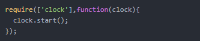
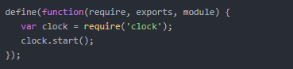

# 关于模块化
### 模块化出现原因

早期的javascript版本没有块级作用域、没有类、没有包、也没有模块，这样会带来一些问题，如复用、依赖、冲突、代码组织混乱等，随着前端的膨胀，模块化显得非常迫切。

### 模块化的好处

1.避免变量污染，命名冲突

2.提高代码复用率

3.提高了可维护性

4.方便依赖关系管理

### 模块化规范

### CommonJS

CommonJs 是服务器端模块的规范，Node.js采用了这个规范。
一个简单的require：
```js

function require(/* ... */) {
const module = { exports: {} };
((module, exports) => {
// Module code here. In this example, define a function.
// 模块代码在这里，在这个例子中，我们定义了一个函数
function someFunc() {}
    exports = someFunc;
// At this point, exports is no longer a shortcut to module.exports, and
// this module will still export an empty default object.
// 当代码运行到这里时，exports 不再是 module.exports 的引用，并且当前的
// module 仍旧会导出一个空对象(就像上面声明的默认对象那样)
module.exports = someFunc;
// At this point, the module will now export someFunc, instead of the
// default object.
// 当代码运行到这时，当前 module 会导出 someFunc 而不是默认的对象
  })(module, module.exports);
return module.exports;
}
```

export和module.exports的区别：

export 是 module.exports 的引用。作为一个引用，如果我们修改它的值，实际上修改的是它对应的引用对象的值。

commonJS用同步的方式加载模块。在服务端，模块文件都存在本地磁盘，读取非常快，所以这样做不会有问题。但是在浏览器端，限于网络原因，更合理的方案是使用异步加载。

### ES6模块化

即import/export 语句， 不同于commonJS,es6的模块化支持异步加载，并且为静态编译，ES6 模块与 CommonJS 模块的差异：

CommonJS 模块输出的是一个值的拷贝，ES6 模块输出的是值的引用 （首次require不同路径的文件，会在require.cache中保存一份缓存，下次读取的时候就直接从缓存中读取了）

CommonJS 模块是运行时加载，ES6 模块是编译时输出接口。

CommonJS 加载的是一个对象（即module.exports属性），该对象只有在脚本运行完才会生成。而 ES6 模块不是对象，它的对外接口只是一种静态定义，在代码静态解析阶段就会生成

这也是为什么TypeScript 支持静态类型检查的原因 因为它使用的是ES6模块化方案，不仅如此，现在node也可以用到es6的模块化方案，用experimental或babel即可。

### AMD和CMD

异步加载模块，适用于浏览器端，AMD是依赖前置，先定义所有依赖，然后在加载完成后的回调函数里执行。



CMD是依赖就近，用的时候再require。它写起来是这样的：



requireJs实现了AMD，seaJs实现CMD