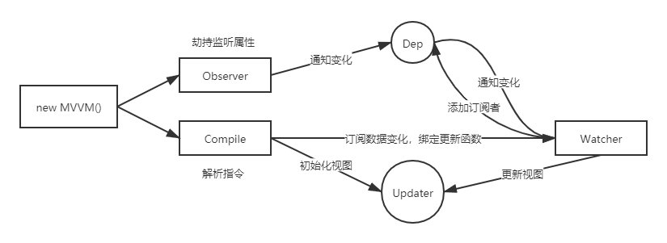

# MVVM
MVVM是Model-View-ViewModel的简写,即模型-视图-视图模型。模型指的是传递的数据。视图指的是所看到的页面。视图模型是mvvm模式的核心，它是连接view和model的桥梁。它有两个方向：一是将【模型】转化成【视图】，即将数据转化成所看到的页面。实现的方式是：数据绑定。二是将【视图】转化成【模型】，即将所看到的页面转化成数据。实现的方式是：DOM 事件监听。这两个方向都实现的，我们称之为数据的双向绑定。
总结：在MVVM的框架下视图和模型是不能直接通信的。它们通过ViewModel来通信，ViewModel通常要实现一个observer观察者，当数据发生变化，ViewModel能够监听到数据的这种变化，然后通知到对应的视图做自动更新，而当用户操作视图，ViewModel也能监听到视图的变化，然后通知数据做改动，这实际上就实现了数据的双向绑定。并且MVVM中的View 和 ViewModel可以互相通信。MVVM流程图如下：

# MVC
MVC是Model-View- Controller的简写，即模型-视图-控制器。M和V指的意思和MVVM中的M和V意思一样。相对前端而言，C即Controller指的是页面业务逻辑。使用MVC的目的就是将M和V的代码分离。MVC是单向通信。也就是View跟Model，必须通过Controller来承上启下。MVC和MVVM的区别并不是VM完全取代了C，ViewModel存在目的在于抽离Controller中展示的业务逻辑，而不是替代Controller，其它视图操作业务等还是应该放在Controller中实现。也就是说MVVM实现的是业务逻辑组件的重用。

# vue双向数据绑定原理
应用观察者-订阅者（数据劫持）：
Observer 数据监听器，把一个普通的 JavaScript 对象传给 Vue 实例的 data 选项，Vue 将遍历此对象所有的属性，并使用Object.defineProperty()方法把这些属性全部转成setter、getter方法。当data中的某个属性被访问时，则会调用getter方法，当data中的属性被改变时，则会调用setter方法。
Compile指令解析器，它的作用对每个元素节点的指令进行解析，替换模板数据，并绑定对应的更新函数，初始化相应的订阅。
Watcher 订阅者，作为连接 Observer 和 Compile 的桥梁，能够订阅并收到每个属性变动的通知，执行指令绑定的相应回调函数。Dep 消息订阅器，内部维护了一个数组，用来收集订阅者（Watcher），数据变动触发notify 函数，再调用订阅者的 update 方法。执行流程如下：

从图中可以看出，当执行 new Vue() 时，Vue 就进入了初始化阶段，一方面Vue 会遍历 data 选项中的属性，并用 Object.defineProperty 将它们转为 getter/setter，实现数据变化监听功能；另一方面，Vue 的指令编译器Compile 对元素节点的指令进行解析，初始化视图，并订阅Watcher 来更新视图， 此时Wather 会将自己添加到消息订阅器中(Dep),初始化完毕。当数据发生变化时，Observer 中的 setter 方法被触发，setter 会立即调用Dep.notify()，Dep 开始遍历所有的订阅者，并调用订阅者的 update 方法，订阅者收到通知后对视图进行相应的更新。因为VUE使用Object.defineProperty方法来做数据绑定，而这个方法又无法通过兼容性处理，所以Vue 不支持 IE8 以及更低版本浏览器。另外，查看vue原代码，发现在vue初始化实例时， 有一个proxy代理方法，它的作用就是遍历data中的属性，把它代理到vm的实例上，这也就是我们可以这样调用属性：vm.aaa等于vm.data.aaa。